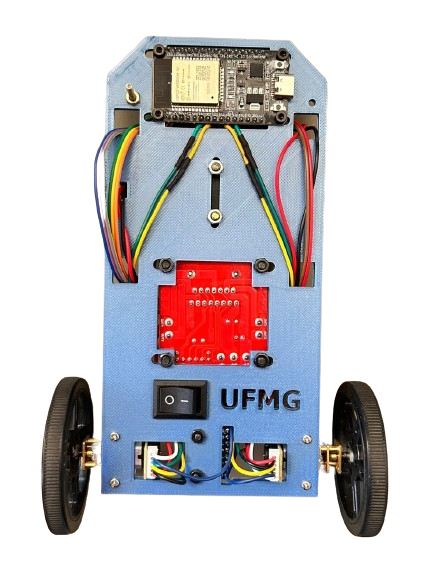
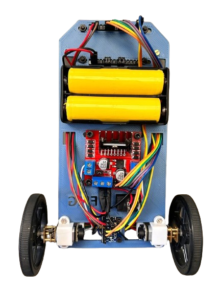
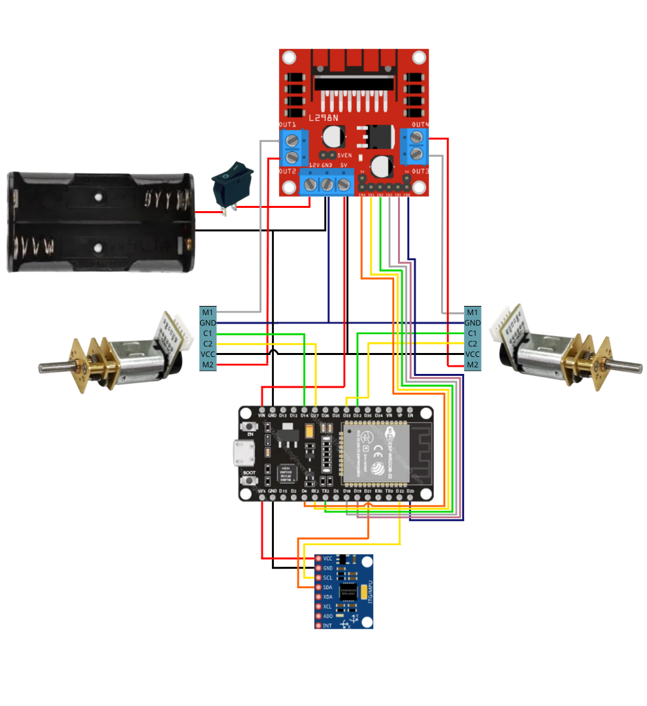

# Diciclo Autonomo

Este repositório reúne todos os recursos necessários para o desenvolvimento de um diciclo autônomo, também conhecido como pêndulo invertido sobre rodas. Nele, você encontrará códigos para modelagem, controle e experimentação, bem como técnicas para a identificação de parâmetros complexos que são cruciais para o comportamento dinâmico do sistema. Além disso, o repositório oferece materiais que abrangem tanto a parte teórica, para o entendimento do funcionamento, quanto a parte prática, voltada para a construção e implementação do projeto.

## Tabela de conteúdos
- [Motivação](#motivação)
- [Primeiros passos](#primeiros-passos)
- [Modelagem](#modelagem)
- [Controle](#controle)
- [Credits](#credits)

## Motivação
- Falta de projetos que unam a parte teórica de modelagem e controle com a prática de implementação.

- Oferecer um projeto simples de replicar e entender, tornando mais fácil o acesso às técnicas de controle e automação.

- Desenvolver um projeto acessível financeiramente, já que muitos dispositivos e projetos prontos são caros e difíceis de adquirir.

## Primeiros passos

#### Lista de componentes
* 1 ESP32;
* 2 Motores DC - Mini motor DC com caixa de redução, 6 V e 500 RPM;
* 1 Regulador de tensão - Ponte H L298N;
* 1 IMU - MPU6050;
* 1 Suporte de pilhas;
* 2 Pilhas - Pilha de lítio de 3,7 V cada;
* 1 Botão chave On/Off;
* Base do díciclo autônomo - Arquivo .stl para impressão 3D;
* 1 Cabo para soldar e 12 cabos com conectores fêmea dos 2 lados;
* 10 Parafusos M2;
* 2 Parafusos M2 com cabeça achatada;
* 2 Parafusos M2 longos para proteção;
* 2 Parafusos M1.5 para os motores.

#### Montagem

Inicialmente, monte os componentes na estrutura conforme as figuras abaixo:

Em seguida, solde um dos terminais da chave On/Off com o cabo e o outro terminal com a alimentação do suporte de pilha (cabo vermelho).
E por fim, complete o circuito seguindo o diagrama elétrico  representado na figura abaixo:

#### Software 

1. Acesse o site oficial do Arduino, ou clique [aqui](https://www.arduino.cc/en/software), e baixe a versão do Arduino IDE correspondente ao seu sistema 
2. Instale o driver do ESP32 depois de descompactar o arquivo "CP210x_Windows_Drivers.zip" disponível na pasta [Programas auxiliares](https://github.com/JessicaLuana1377/diciclo_autonomo/tree/main/Progamas%20auxiliares) do repositório, ou pesquise por "CP210x USB to UART Bridge", acesse o site oficial da Silicon Labs, vá na aba de downloads e baixe o arquivo "CP210x Universal Windows Driver". 
3. Instale a placa do ESP32 no Arduino IDE. Abra o Arduino IDE, vá em Tools > Board > Board Manager, pesquise por esp32 by Espressif Systems, selecione a versão 2.0.17 e instale.
4. Instale as bibliotecas usadas no projeto. Vá em Sketch > Include Library > Manage Libraries pesquise e instale as bibliotecas: ESP32Encoder by Kevin Harriongton versão 0.11.6 e Adafruit MPU6040 by Adafruit versão 2.2.6 (Baixe todas as dependências dessa biblioteca).

Qualquer dúvida, o procedimento está mais detalhado na seção 2.4 do Manual (posteriormente, será inserido um manual em PDF no repositório).

Realizando todos os passos corretamente, é possivel carregar qualquer um dos códigos disponíveis no ESP32.

#### Testes
  A pasta [CodigosDisponiveis](https://github.com/JessicaLuana1377/diciclo_autonomo/tree/main/CodigosDisponiveis) tem 3 arquivos:
  - IMU: Contém um código de teste para o funcionamento da IMU;
  - Encoder: Contém um código de teste para o funcionamento e serve para garantir que os pinos estão corretamente conectados;
  - Controle de velocidade: Contém 3 arquivos, sendo eles
      - Um arquivo .mlx que aborda detalhadamente a modelagem e o controle de um motor, utilizando dados reais para determinar o modelo de um motor específico, além de outros dados experimentais que comprovam a eficácia do controlador;
      - Um código para obter os dados de um motor para modelagem;
      - Um código de controle que também exporta os dados para monitorar e analisar o desempenho do controlador;
      - Um arquivo .txt com dados experimentais de exemplo para modelagem;
      - Um arquivo .txt com dados experimentais de exemplo do controle.

## Modelagem
A modelagem do sistema está disponível no arquivo "Modelo_novo.mlx", na pasta [Modelo](https://github.com/JessicaLuana1377/diciclo_autonomo/tree/main/Modelo). Para obter o modelo corretamente, deve-se alterar os valores das variáveis no tópico "Valores das variáveis" dentro do arquivo e executar os experimentos do [Corpo](https://github.com/JessicaLuana1377/diciclo_autonomo/tree/main/Modelo/Corpo) e das [Rodas](https://github.com/JessicaLuana1377/diciclo_autonomo/tree/main/Modelo/Rodas), antes de executar o arquivo "Modelo_novo.mlx". Após realizar os experimentos, execute o arquivo "Modelo_novo.mlx" e ele irá gerar o modelo do seu pêndulo e exportar os dados necessários para a pasta de [Controle](https://github.com/JessicaLuana1377/diciclo_autonomo/tree/main/Controle). Evite trocar os arquivos de diretórios para que funcionem corretamente.

## Controle
Na pasta [Controle](https://github.com/JessicaLuana1377/diciclo_autonomo/tree/main/Controle) está disponível o desenvolvimento de um controlador Compensador de Avanço e Atraso no arquivo "Compensador.mlx". O arquivo "fts.mat" deve ter sido gerado a partir do seu modelo, portanto, tenha certeza que o arquivo de modelagem foi completamente executado antes de vir para este passo. Após realizar os ajustes necessários no controlador, pegue os ganhos disponíveis no tópico "Ganhos discretizados dos controladores" e substitua no arquivo "controle_lead_lag.ino" disponível na pasta [controle_lead_lag](https://github.com/JessicaLuana1377/diciclo_autonomo/tree/main/Controle/controle_lead_lag). Teste seu controlador e realize ajustes finos caso seja necessário.
Outro controlador esta disponível na pasta [Controle](https://github.com/JessicaLuana1377/diciclo_autonomo/tree/main/Controle), é um controlador avançado LQR com integrador e uma implementação simples de um filtro de Kalman, caso tenha curiosidade, teste no seu pêndulo.

## Credits

## Authors

